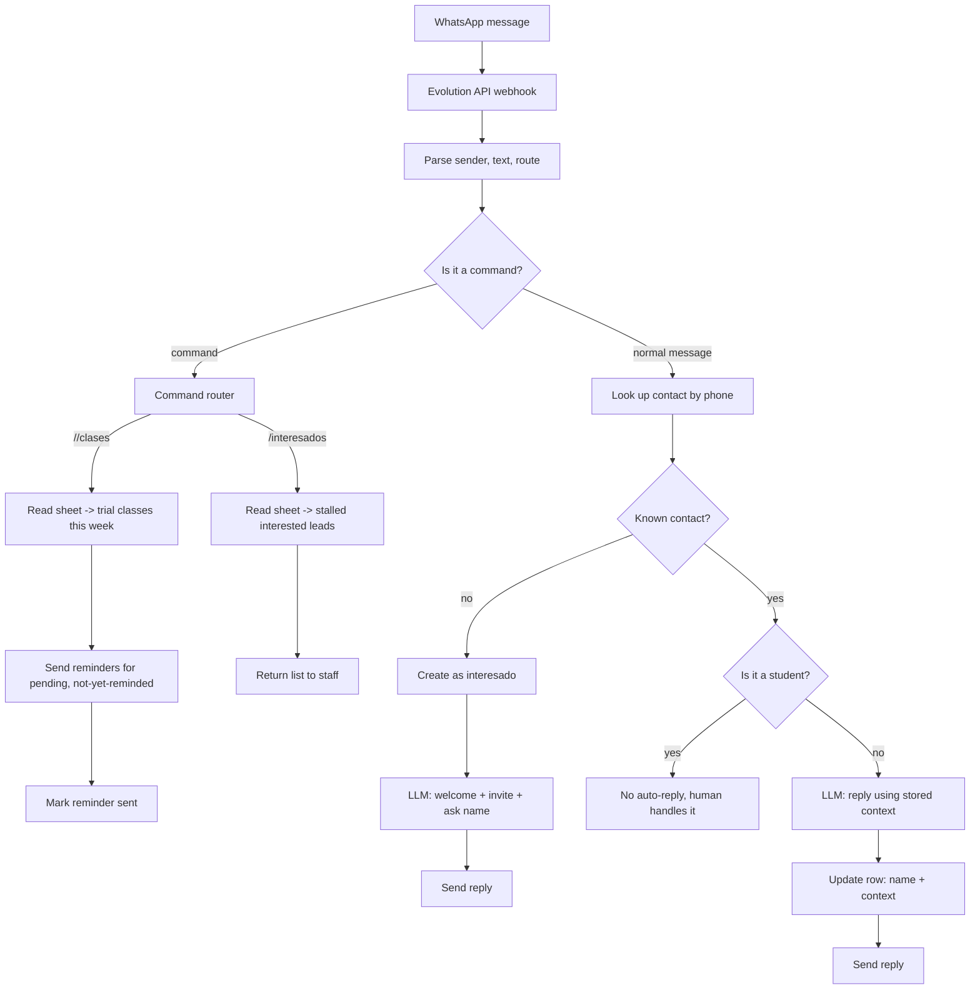

# Gym Lead Assistant — Prototype

A WhatsApp assistant I built for a gym. It answers **new and
interested leads**, invites them to a free trial class, and captures their name —
while deliberately staying out of conversations with existing students.

This is a portfolio demonstration, not a production deployment. The workflow I
included is inactive and sanitized. I removed all live credentials, customer
records, account identifiers, and production endpoints.

## The problem

Small gyms get a lot of repetitive WhatsApp questions (schedules, prices, trial
classes, how to sign up) and staff answer them by hand, often outside working
hours. But a bot is not welcome in *every* conversation: existing students ask
specific things and have normal, human chats. So I aimed the assistant only at
the people the gym does not know yet.

## How it works

- **Unknown contact** → I tag them as `interesado`, send a welcome, invite them
  to a trial class, and ask for their name.
- **`interesado`** → the assistant keeps the conversation going using a short
  stored context, answers questions, and keeps inviting to the trial class.
- **`alumno`** (student) → the assistant does **not** reply; a human handles it.
- I keep a **central configuration node** with the gym's information and tone, so
  the assistant only shares what the gym allows.
- A **state column** in the sheet tracks the lead's status, their trial class,
  and whether a reminder was already sent.

Every conversation aims to: give the information, invite to a free trial class,
and get the name so replies become more personal.

## Staff commands

I route messages that start with a command prefix as staff actions, not customer
replies:

- **`//clases`** — shows this week's trial classes and, for the next slot, sends
  reminders to leads who have a booked class and were not reminded yet (it marks
  each one so the same reminder is never sent twice).
- **`/interesados`** — scans the list of interested leads and returns the
  conversations that stalled or are worth following up.

## Flow diagram

## Data model (fictional)

The demo expects a Google Sheet named `Gym Demo Leads`. I invented all values; no
real data is included.

| column | example | purpose |
| --- | --- | --- |
| `telefono` | `+54 9 11 5555 0100` | contact identifier |
| `nombre` | `Ana` | captured by the bot when known |
| `genero` | `f` | personalization |
| `estado` | `interesado` / `alumno` | who the bot may talk to |
| `contexto` | `pidio precios` | short summary of the conversation |
| `clase_prueba` | `2026-10-08 19:00` | booked trial class |
| `recordatorio_enviado` | `si` / `no` | avoids duplicate reminders |
| `mensajes_sin_respuesta` | `1` | follow-up counter |
| `fecha_ultimo_mensaje` | `2026-10-01 18:30` | last interaction |

## What I implemented vs not

Implemented in this demo:

- Webhook intake, message parsing, and command detection.
- Routing between commands and normal messages.
- Lead lookup and the `interesado` / `alumno` decision.
- New-lead welcome and interested-lead reply through the LLM, with a central
  configuration node and JSON-structured output.
- Row creation and update, plus the two staff commands.

Not included (these are next steps, not finished features):

- Real message sending: the HTTP nodes point to a placeholder Evolution API URL.
- Full chat history: the demo uses a short `contexto` column instead of reading
  the whole conversation every time.
- Scheduled reminders: `//clases` triggers them on demand; a time-based trigger
  is a future improvement.
- End-to-end runtime verification: I have not run the workflow here.

## Repository contents

- `workflows/gym-lead-assistant-demo.json` — sanitized, inactive n8n workflow template.
- `docker-compose.yml` — local-only reference stack for n8n, Evolution API, PostgreSQL, and Redis.
- `.env.example` — variable names and deliberately invalid placeholders; never use it as-is.

## Local setup

1. Copy `.env.example` to `.env` and replace every `REPLACE_WITH_...` value with a local test value. Select and pin reviewed image versions before starting containers.
2. Start the stack with `docker compose up -d`.
3. Open n8n at `http://localhost:5678` and complete its local owner setup.
4. Import the workflow JSON. Create your own Google Sheets, LLM, and Evolution API credentials in n8n, then configure the placeholder sheet and endpoint fields in the imported workflow.
5. Keep the workflow inactive until you have tested it with synthetic data and verified each destination.

The Compose ports are bound to loopback for local development. This file is not a production deployment guide. Do not expose the services to the internet or use real customer conversations without a separate security and privacy review.

## Security notes

- Do not commit `.env`, exported workflows from a live n8n instance, credential exports, database volumes, or real customer data.
- Do not put API keys, OAuth tokens, webhook URLs, spreadsheet IDs, or phone numbers in workflow JSON. Configure credentials and resources in your own n8n instance.
- Replace the intentionally invalid image tags in `.env` with exact versions that you have reviewed before starting the stack.
- The LLM receives message content sent through the workflow. Use synthetic messages in this demo.

## Project status

This is a personal prototype. I did **not use it with real customers**; any
testing was local and with synthetic data. I have not verified the workflow end
to end, and I make no business-impact or operational-result claims.

## License

All rights reserved. No license is granted: I'm sharing this material for viewing
only, and it may not be copied, reused, or redistributed without my written
permission.
